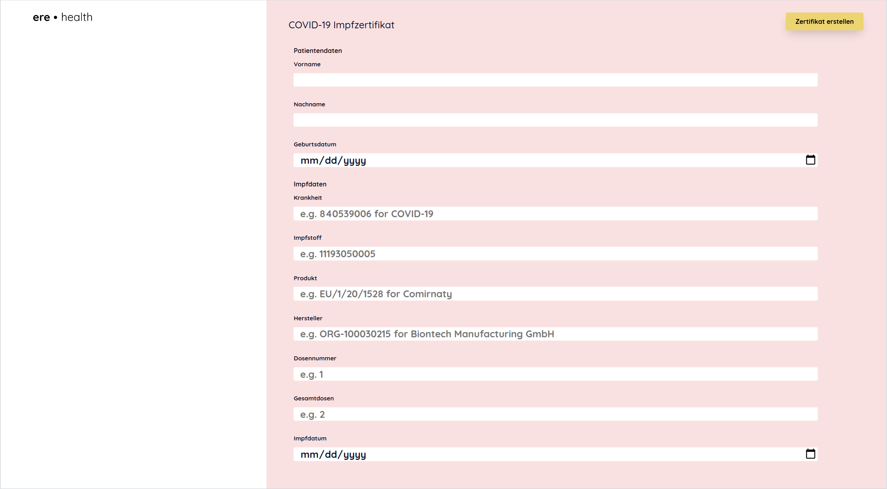
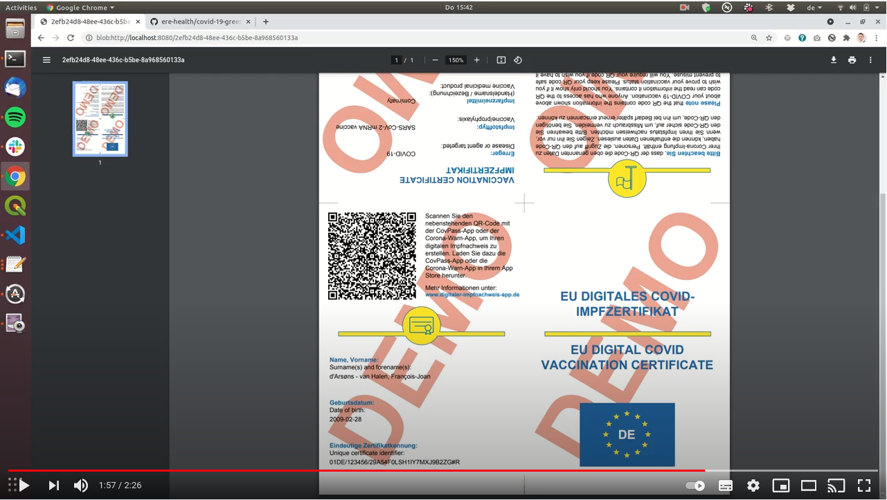
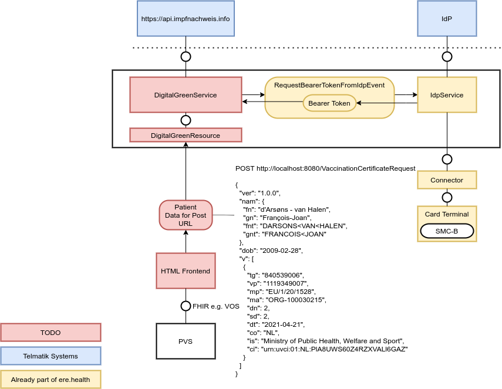
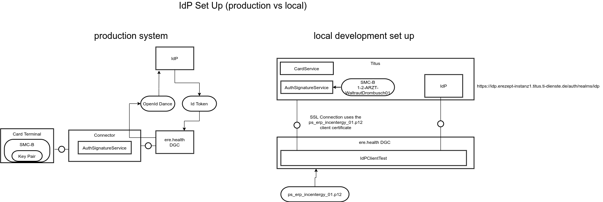
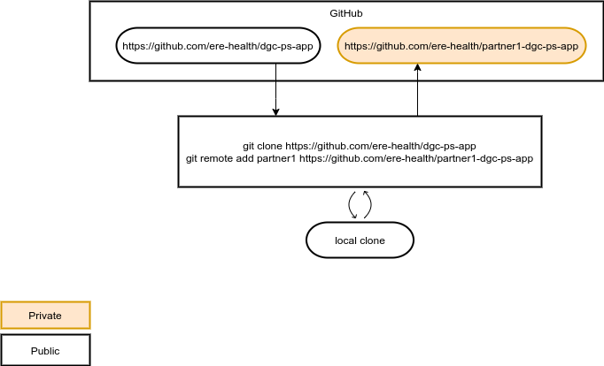

# Impfzertifikatsservice Frontend

# Screenshot

# YouTube Video

The link above takes you to a german demo video.

# Code

https://github.com/ere-health/dgc-ps-app

# REST API

OpenAPI Specification: https://github.com/ere-health/dgc-ps-app/blob/main/doc/dgc-openapi-yaml

Example:
http://localhost:8080/api/certify/v2/issue?fn=Manuel&gn=Blechschmidt&dob=1986-07-16&id=BSNR-ARZT&tg=840539006&vp=11193050005&mp=EU/1/20/1528&ma=ORG-100030215&dn=1&sd=1&dt=2021-07-13

# Architecture

# IdP Set up

The set up above shows how the IdP set up differs between production set up and local set up. The flow from the digital green certificate IdP looks the same like the one for the e prescription IdP only the scope is different (openid+erezept vs openid) 

Example Flow: https://gematik.github.io/ref-idp-server/tokenFlowPs.html

# Partner Forks

The image above shows our forking strategy with our partners. We have one open source main repository and create forks for every partner were we can directly collaborate together with their developers. 
